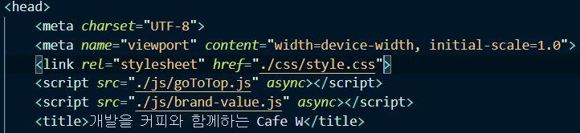
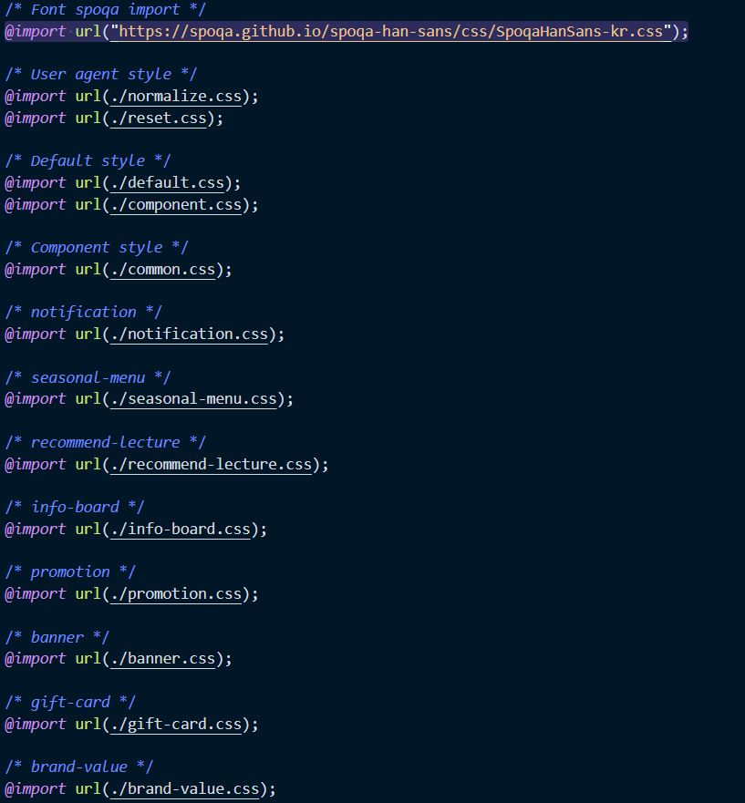

# Cafe W 클론 프로젝트

**우리 안싸웠어요 조원**

- 이재훈 [dannylee9212 깃헙](https://github.com/dannylee9212)
- 강은진 [ejinaaa 깃헙](https://github.com/ejinaaa)
- 김효성 [hyorard-b 깃헙](https://github.com/hyorard-b)

---

**프로젝트 목표**

1. 코드 최적화
   - 논리적인 아웃라인 구조
   - 시맨틱 마크업
   - CSS 모듈화
2. 클래스 네이밍 컨벤션 선택 및 준수
   - BEM (Block Element Modifier)
3. 웹 표준 준수
   - HTML Validation
   - CSS Validation
4. 웹 접근성 향상
   - WAI-ARIA 속성 적용
5. 검색 최적화
6. 크로스 브라우징
   - IE 11
   - Microsoft Edge
   - chrome
   - firefox
7. 성능 향상

---

**역할**

- 이재훈 : 크로스 브라우징, 웹 표준 유효성 검사
- 강은진 : 접근성, 폼 컴포넌트 설계 및 제작
- 김효성 : 성능, 검색 최적화

---

**계획**

1. `<header>`, `<footer>` 공동 제작
   - 코딩 컨벤션 합의
2. 세션 분할
   - 이재훈 : 공지사항, 시즌 메뉴, 인기 강좌, 카페정보 게시판, 프로모션, 배너
   - 강은진 : 강의 커리큘럼, 매장 찾기, 회원 가입 페이지
   - 김효성 : Cafe W 기프트카드, 브랜드 가치, 로그인 페이지
3. Git을 이용한 코드 관리
   - 저장소 관리
     - git fork
   - 브랜치 관리
     - git flow
4. HTML & CSS 유효성 검사
   - Web Developer Chrome Extension
5. 웹 접근성, 성능, SEO 관리
   - Lighthouse Chrome Plugin
6. 크로스 브라우징
   - IE 11
   - Microsoft Edge
   - chrome
   - firefox

---

**프로젝트 구성**

- 폴더 구조

  

- CSS 폴더 구조

  

- 메인 페이지 구조

  

---

**이재훈**

 

1. **문제점** : 처음에 display: none과 block 속성을 이용하여 텝을 구현하였으나 HTML 헤딩구조를 볼때 display: none이 들어가잇는 요소가 빠져있었음

   **해결방법** : container를 이용하여 전체를 감싼후 position 을 이용하여 다시 재 구현


2. **문제점** : IE에서 css가 제대로 기능하지 않았음

   **해결방안** : 좀더 조사해야됨

3. **문제점** : 위로가기 버튼구현시 사용한 js function중에 getBoundingClientRect()가 IE 에서 제대로 기능하지 않음

   **해결방안** : 조사해야됨

**강은진**

- 접근성 이슈

  - placeholder 접근성 문제

  

  

  ```HTML
  <div class="sign-up-formemail-container sign-up-formcontainer sign-section-formcontainer">
      <label for="email" class="sign-up-formlabel sign-section-formlabel text-bold">
          아이디
          <strong class="asterisk">
              
          </strong>
      </label>
      <span class="sign-section-formhint" id="emailHint">
          등록할 사용자 계정을 입력합니다. (예:seulbinim@gmail.com)
      </span>
      <input type="email" class="sign-up-forminput sign-section-forminput" name="email" id="email" autocomplete="on"
                  aria-required="true" aria-describedby="emailHint" aria-invalid="false">
      <span class="sign-section-form__error-message" role="alert" aria-live="polite">입력 오류 메시지</span>
  </div>

  ```

  -

- 약관 동의 옆 체크 박스 커스터마이징

  

  

```CSS

.agree-checkbox::before {
  content: "";
  display: block;
  width: 34px;
  height: 14px;
  border-radius: 7px;
  background: #CFCCC7;
  position: absolute;
  top: -7px;
  left: -10px;
}
.agree-checkbox::after {
  content: "";
  display: block;
  width: 20px;
  height: 20px;
  border-radius: 50%;
  background: #CFCCC7;
  box-shadow: 0px 0px 2px rgba(0, 0, 0, 0.12), 0px 2px 2px rgba(0, 0, 0, 0.24);
  position: absolute;
  top: -10px;
  left: -10px;
  transition: left .3s;
}
.agree-checkbox:checked:after {
  left: 4px;
  background: #7D6F5D;
}
.agree-checkbox:checked::before {
  background-color: #7D6F5D;
}


```

**김효성**

- 성능 최적화 이슈

  - 이미지

  
  

  - 웹 폰트

  

  

  

  

  

- 검색 최적화 이슈
  - `<head>`
    - `<title>`
    - `<meta name="description">`
    - `<meta name="keywords">`
  - `<body>`
    - ``

---

**결과**


